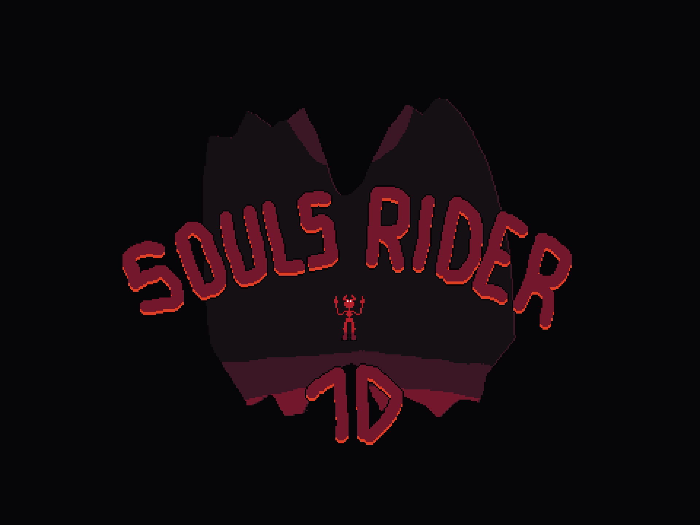

  

# Ludum Dare 57 - Souls Rider 1D

**Each millenium, the Souls Rider wakes up and he crawls out of the [depths](https://ldjam.com/events/ludum-dare/57/souls-rider-1d) to ride his favorite Dimension...**

Welcome! [**Souls Rider 1D**](https://ldjam.com/events/ludum-dare/57/souls-rider-1d) (Ludum Dare 57 Theme: Depths - **COMPO**) is built in **Vanilla JavaScript/WebGL** with [**Theatre.js**](https://github.com/theatrejs)).

**Overview**:

- You are THE Souls Rider waking up and crawling out of the depths!
- This is a **CHALLENGING** puzzle-game
- You can only see and move in 1 Dimension at time, (because you lack of depths...) but you are able to change the orientation of the underground!
- The **experience is better** if you play with a **Gamepad**

**Gamepad**:

- Use the **Left Stick** to move
- Use the **LT/RT** Triggers to change the orientation

**Keyboard**:

- Use the Keyboard **AD/QD** to move
- Use the Keyoard **Left/Right** Arrows to change the orientation

**Screenshots**:

This was my **7th Game Jam**, so I hope you'll like this game. Thank you for your support.

**Each millenium, the Souls Rider wakes up and he crawls out of the [depths](https://ldjam.com/events/ludum-dare/57/souls-rider-1d) to ride his favorite Dimension...**
